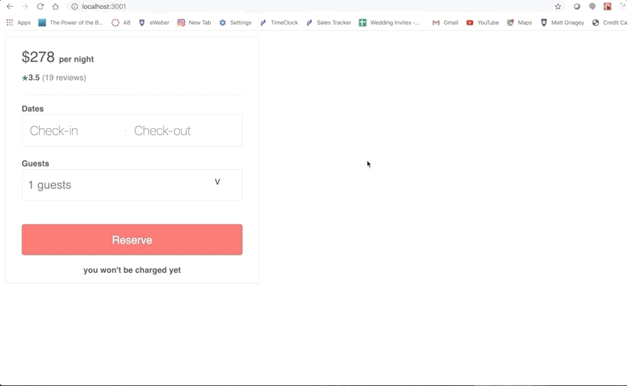
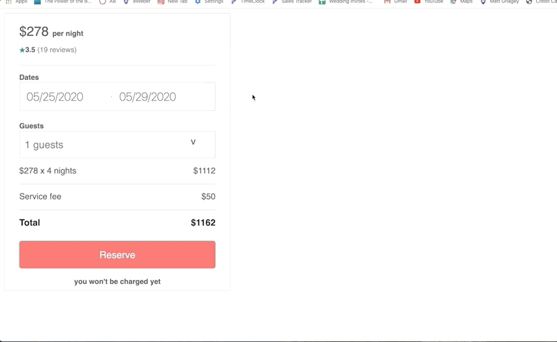
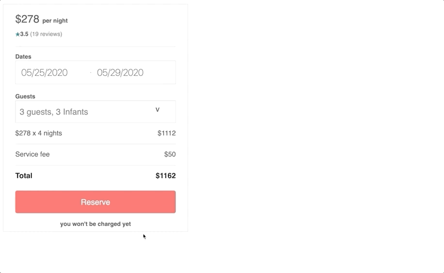

# Reservation Form
This is a node.js application, that attempted to clone the look and functionality of Air bnb's reservation form.  The application can calculate the cost of a potential reservation and it also allows the user to reserve the dates in the database and makes them unavailable for other users to book them. 

## Getting Started

### Prerequisites
A couple of things that you will need installed on your machine (check out their documentaion for installation instuctions)

1. [Mysql](https://dev.mysql.com/downloads/mysql/)
2. [Docker](https://www.docker.com/products/docker-desktop)

##### Recommended
* [Nodemon](https://nodemon.io/)

### Installing
When you are located in the root of the project folder run the following command in the terminal:
```
npm install
```

### Intial Set-up

1. Create a .env file in the root of the project with the following key value pairs:
```
DB_PW=(secret password goes here)
DB_USER=(database user)
DB_DB=reservation_db
```

2. If you would like to populate the database with fake properties and fake reservations for each property you must run the following commands

```
npm run schema
```
This will create the 'reservation_db' database and it will also create the two tables that will be holding the data.

Next run the following:
```
npm run populateDB
```
This will populate the database with 100 fake property records, and each property will have a random number of reservations over the period of the next couple of months.

## App Features

#### Select Dates & View Price



#### Select Guest Amount



#### Reserve Dates

Notice that the dates selected from early are no longer available after 'Reserve' button is clicked.



## Deployment

I deployed this project using Docker and AWS.  The Dockerfiles and docker-compose files are included in this repository.  The database was deployed and populated with 100 records on an EC2 instance. This image below is a representation of a proxy server that served the reservation-form microservice as well as other microservices from project members to create a replica of a property page on airbnb 


This [link will take you to that repository](https://github.com/There-By-The-Sea/reservation-proxy)

## Built With
* Node.js
* Express
* React
* HTML
* CSS
* MySQL
* Docker
* AWS (Deployment)

## License
MIT license [here](https://github.com/There-By-The-Sea/reservation-form/blob/master/LICENSE)
